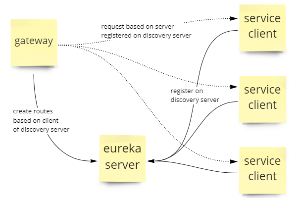

## Projeto desenvolvido para estudos do Spring Cloud Gateway e Spring Cloud Eureka.

O objetivo é validar o comportamento do load balancing dos clients e gateway no caso do gateway possuir apenas rotas criadas automaticamente a partir dos clients fornecidos pelo eureka server.

